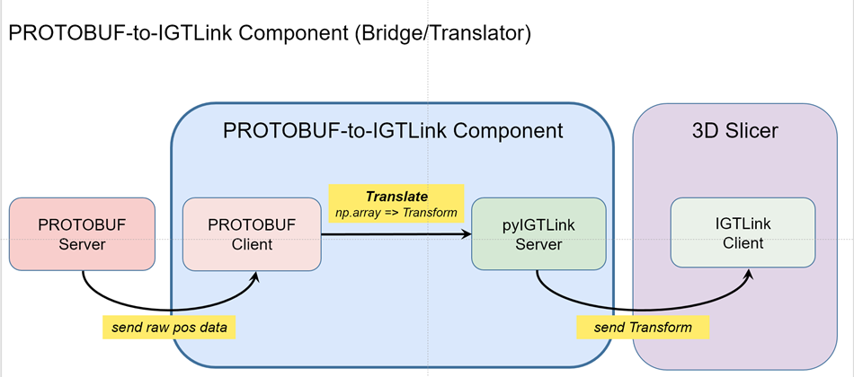

<div align="center">

<h1> EPCMR — Electrophysiology CMR Toolkit</h1>

**A multi-procedure EP-CMR suite for 3D Slicer**, supporting Right-Atrial (RA) Flutter
and Pulmonary-Vein / PVC ablation workflows with real-time MR-tracked catheter guidance.


</div>

> ⚠️ **Research software only.** EPCMR is *not* a medical device and is *not* cleared
> or approved by any regulatory body (FDA, CE/MDR). It must not be used for clinical
> diagnosis, treatment, or any decision affecting patient care. See [LICENSE](LICENSE).

---

## Overview

EPCMR is a [3D Slicer](https://www.slicer.org/) scripted-loadable extension that brings
electrophysiology (EP) cardiac-MR workflows into Slicer. It combines pre-procedural
anatomy, interactive angulation, and **live MR-tracked catheter visualization** streamed
over [OpenIGTLink](http://openigtlink.org/).


### Features

- **RA Flutter** — right-atrial flutter mapping and ablation support.
- **PVC Ablation** — pulmonary-vein / PVC ablation workflow.
- **FreeAngulator** — interactive scan-plane angulation from segmented anatomy.
- **Mapping** — colour-mapped activation/parameter display on cardiac surfaces.
- **Live & Replay modes** — drive the scene from a live MR-tracking stream *or* replay
  recorded sessions for development, demos, and teaching.

### Architecture at a glance

```
MR scanner ──(MRTC protocol)──▶  mrtc_CathTrack  ──(OpenIGTLink / pyigtl)──▶  EPCMR (Slicer)
                                  bridge & tracker                            visualization
```

<div align="center">



*Data bridge: MR-tracking stream → `mrtc_CathTrack` → OpenIGTLink → EPCMR in 3D Slicer.*

</div>

- **`mrtc_CathTrack/`** — a standalone bridge that speaks the vendor MR-tracking
  protocol (MRTC, via protobuf) and re-publishes catheter transforms as an OpenIGTLink
  server on port `18944`.
- **`EPCMR` module** — connects as an OpenIGTLink client, renders catheters, and runs the
  RA-Flutter / PVC / FreeAngulator workflows.

---

## Requirements

- **3D Slicer** 5.7 or newer (Python 3.12 environment).
- **SlicerOpenIGTLink** Extension installed (Extension Manager)
- **`pyigtl`** — auto-installed into Slicer's Python on first launch (the module prompts
  and installs via `pip` if missing).
- For the `mrtc_CathTrack` bridge (standalone Python): `protobuf`, `crc32c`.

---

## Installation

### As a Slicer extension (development install)

1. Clone this repository.
2. In Slicer: **Edit ▸ Application Settings ▸ Modules ▸ Additional module paths** →
   add the repository root (the folder containing `EPCMR.py`).
3. Restart Slicer. EPCMR appears under the **Cardiac** category.

### Building with CMake (for packaging)

Standard Slicer extension build via `CMakeLists.txt` / `EPCMR.s4ext`. Point the Slicer
build system at this source tree as an external extension.

---

## Quick start (Replay mode)

You can explore the full workflow without a scanner using the bundled example data:

1. Load the sample anatomy from [`ExampleData/`](ExampleData/) (NRRD volume + STL models).
2. In the EPCMR module, switch to **Replay** mode and point it at
   [`ExampleData/replay_jsonlines/igtl_stream.jsonl`](ExampleData/replay_jsonlines/)
   (or the recorded tracking pickle).
3. Start replay to see catheter transforms drive the scene.

---

## Tutorials

Several video tutorials are available demonstrating catheter navigation and voltage mapping:

1. [`Tutorial Video 1`](docs/videos/TutorialVideo_01_Captions.mp4) : Scene Setup & Real-time Catheter Navigation
2. [`Tutorial Video 2`](docs/videos/TutorialVideo_02_Captions.mp4) : Activation Time Mapping
3. [`Tutorial Video 3`](docs/videos/TutorialVideo_03_Captions.mp4) : Voltage Mapping

---

## Repository structure

```
EPCMR.py                  Slicer module entry point (registration, UI, logic glue)
EPCMRLib/                 Module implementation (Python package)
  ├─ RAFlutter/           RA flutter widget + logic
  ├─ PVCAblation/         PVC ablation widget + logic
  ├─ FreeAngulator/       Interactive angulation widget + logic
  ├─ Mapping/             Mapping-mode selection
  ├─ Utilities/           Shared services (scene mgmt, replay, colour mapping, …)
  └─ EPCMRParameterNode.py
mrtc_CathTrack/           Standalone MR-tracking ⇄ OpenIGTLink bridge (protobuf)
Resources/                Module runtime assets (icons, .ui, geometry)
ExampleData/              Sample anatomy + recorded tracking streams for demo/replay
Testing/                  CTest / Slicer unit-test scaffolding
typings/                  Type stubs for Slicer/Qt/VTK/CTK (editor support only)
docs/                     Documentation (see below)
```

---

## Documentation

Extended documentation lives in [`docs/`](docs/) (images under `docs/images/`).
*More documentation is being added.* For now, see this README and the in-module
**Help & Acknowledgement** panel.

---

## Contributors

A joint engineering & development effort of:

- **Heart Center Leipzig** (Leipzig, Germany) — Ingo Paetsch, Cosima Jahnke
- **Philips Research** (Eindhoven, NL / Hamburg, DE) — Christian Stehning, Sascha Krueger, Steffen Weiss, Jouke Smink
- **ETH Zurich** (Zurich, Switzerland) — Sandra Haltmeier, Max Fuetterer, Sebastian Kozerke

---

## License

Distributed under the **BSD 3-Clause License**. See [LICENSE](LICENSE) for full terms,
including the research-software notice.
